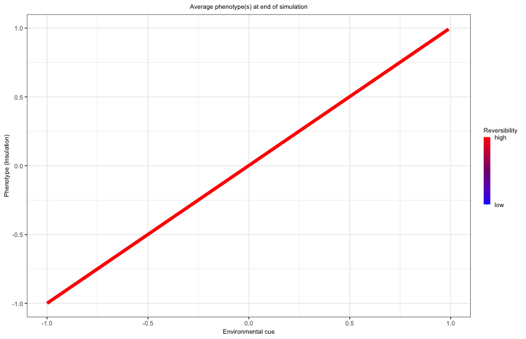
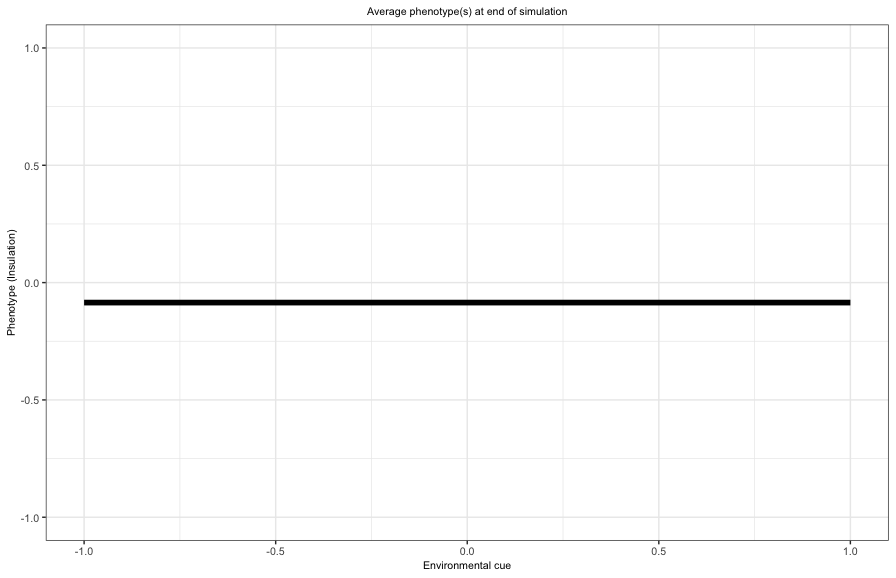
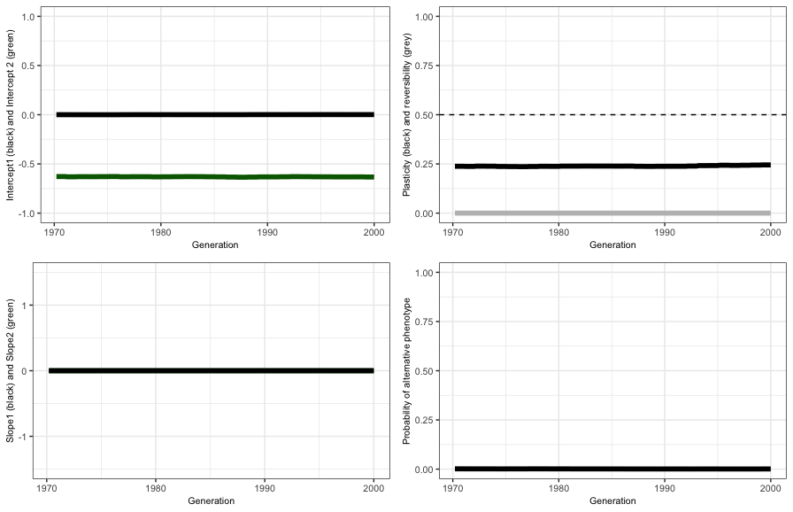

```{r setup, include=FALSE}
rm(list=ls())
library(learnr)
library("tidyverse")
setwd(dirname(rstudioapi::getActiveDocumentContext()$path))
source("Script_model.R")
knitr::opts_chunk$set(echo = FALSE)
```

## Introduction

In this tutorial, you will learn about the agent-based model and practice with running the model and interpreting outcomes. 

### Check if everything works

Please run the following line. You will get a message that the model runs successfully, if not ask for help.

```{r add-function, exercise=TRUE, exercise.lines = 1}
run.model(P = 1, R = 1, seed = 1, Max_gen = 1, test = T)
```


## The environment

We are using an agent-based model, meaning each individual in a population is modeled separately. Time in the simulation progresses in discrete steps, with each individual living exactly five steps after which they reproduce asexually (generations do not overlap).
During each time step, individuals experience an environment we interpret as temperature, which ranges from very cold (-1) to very warm (1). The environmental conditions are modeled with a sinusoidal wave, following  
\begin{equation}
E = \sin(2  \pi  t / (L  R)).
\end{equation}
In this equation, variable $t$ equals the time, parameter $L$ is the lifespan of each individual (5 in our model), while parameter $R$ affects the period. Use the function 'plot_env' below to explore how the environment changes as a function of parameter $R$. Depending on your R value, you might need to change the number of timesteps for which you want to plot (max_time)

```{r env-function, exercise=TRUE, exercise.lines = 2}
plot_env(R = 10, max_time = 100)
```

a.  With a lifespan of 5 time units (default value) and a value of $R = 1$, what kind of environment(s) does an individual experiences in its life?
b.  What kind of environment(s) does an individual experiences in its life when $R = 100$?
c.  How would you interpret parameter $R$?

## The cue

In nature, environmental changes, like temperature, are often predictable through signals (or "cues") such as day length or air pressure. For example, in temperate regions, day length is a good predictor of seasonal temperature changes. However, cues are not necessarily reliable. If today is a sunny day, for example, this does not necessarily give us information about tomorrow's weather. In our model, we adjust how strongly a cue predicts the future environment (temperature) to reflect different levels of environmental predictability. The cues, $C$, are drawn from a normal distribution with mean $\mu = P * E$ and a standard deviation $\sigma = (1 - P) / 3$. Because 99.7% of the values in a normal distribution are contained within $3\sigma$ from the mean, dividing by three in the equation for $\sigma$ ensures that cues are primarily from the natural range of possible environmental values. Use the function `plot_cue` or `plot_cue_withenv` below to explore how the environmental cue changes as a function of the environment for different levels of parameter $P$. Make the plot several times for each value of $P$ that you explore.

```{r cue-function, exercise=TRUE, exercise.lines = 2}
plot_cue(P = 0)
```

```{r cue-function2, exercise=TRUE, exercise.lines = 2}
plot_cue_withenv(P = 0, R = 1, max_time = 20)
```

a.  How would you interpret parameter $P$?
b.  Why where you asked to make the plot multiple times for each value of $P$?

## The phenotype of the individual

We use the term insulation ($I$) as a description of the phenotype of an individual. It could be some morphological (e.g., fur thickness), behavioral (e.g., taking shelter), or physiological (e.g., sweating) trait that helps individuals to deal with thermal stress. The closer an individual’s insulation matches the current temperature the better. If, for example, the environment has a value of $E = 0.7$, the optimal level of insulation should equal $I = E = 0.7$.

Each individual has 7 genes that together determines its phenotype. The genetic code includes two sets of genes that specify possible insulation levels under different environmental cues, each with an intercept and a slope value. The phenotype (insulation level) is given by either 
\begin{equation}
I = \mathrm{intercept_1} + \mathrm{slope_1} * C
\end{equation}
or 
\begin{equation}
I = \mathrm{intercept_2} + \mathrm{slope_2} * C.
\end{equation}
We will explain the role of the genes **intercept~2~** and **slope~2~** later. Whether slope is used depends on the value of the plasticity gene **gene_pls**. If gene_pls is greater than 0.5, the individual shows *phenotypic plasticity*, meaning it adjusts its insulation according to both intercept and slope in response to environmental cues. If gene_pls is 0.5 or less, only the intercept value is used, so insulation remains fixed and does not respond to cues (phenotype = intercept). Use the following code to explore how the three genes **intercept~1~**, **slope~1~**, and **gene_pls** affect the reaction norm. For now, you can ignore the legend on the right side of the plot. 

```{r plasticity-function, exercise=TRUE, exercise.lines = 2}
plot.strategy(intercept1 = 0.5, slope1 = 0.1, gene_pls = 0)
```

Assume that an individual is plastic (gene_pls > 0.5). What would be the optimal intercept and slope to deal with temperature?
```{r optimalvalue}
quiz(
  question("What would be the optimal value for the intercept?",
    answer("-1"),
    answer("0",correct = TRUE),
    answer("1")
  ),
  question("What would be the optimal value for the slope?",
    answer("-1"),
    answer("0"),
    answer("1",correct = TRUE)
  )
)
```

If individuals are plastic (gene_pls > 0.5), they can adjust their insulation during life, with a probability of **gene_devp** per timestep. For low values of gene_devp, individuals will only adjust their phenotype at birth (irreversible plasticity), for high values of gene_devp, they can continually switch phenotypes throughout life (reversible plasticity). 

Use the following code to explore how the four genes **intercept~1~**, **slope~1~**, **gene_pls**, and **gene_devp** affect the reaction norm. Pay close attention to the legend on the right side of the plot. 

```{r reversibility-function, exercise=TRUE, exercise.lines = 2}
plot.strategy(intercept1 = 0.5, slope1 = 0.1, gene_pls = 0, gene_devp = 0)
```

At birth, each individual has a probability, determined by the gene **gene_bh**, of using the second set of genes (**intercept~2~** and **slope~2~**) instead of the first (**intercept~1~** and **slope~1~**). 
```{r bh}
quiz(
  question("Which response strategy is modelled with gene_bh?",
    answer("Adaptive tracking"),
    answer("Reversible plasticity"),
    answer("Irreversible plasticity"),
    answer("Diversifying bet-hedging", correct = TRUE),
    answer("Conservative bet-hedging")
  )
)
```

Use the following code to explore how all the 7 genes **intercept~1~**, **slope~1~**,**intercept~2~**, **slope~2~**, **gene_bh**, **gene_devp**, and **gene_pls** affect the reaction norm(s). 
```{r bh-function, exercise=TRUE, exercise.lines = 2}
plot.strategy(intercept1 = 0.5, slope1 = 0, gene_pls = 0, gene_devp = 0,
              intercept2 = -0.5, slope2 = 0, gene_bh = 0)
```


## The fitness of an individual

Fitness depends on how well an individual’s insulation matches the current temperature: the closer the match, the higher its fitness and offspring production. Being plastic comes with a costs, which will decrease the number of offspring an individual produces. Individuals who adjust continually incur extra costs each time they change their insulation. 

Each timestep, we calculate the mismatch $M$ between the environment and the phenotype of an individual $i$, such that
\begin{equation}
M_{i,t} = |E_t - I_{i,t}|
\end{equation}
At the end of a generation, the fitness $W_i$ of an individual is computed as the sum total of phenotypic mismatches throughout life, such that 
\begin{equation}
W_i = \exp(-\tau * \sum\limits_{t=1}^L M_{i,t}) - \mathrm{c_{plast}} - n \mathrm{c_{devp}},
\end{equation}
where parameter $\tau$ determines the strength of the fitness decay as a function of the total mismatch. Parameter $\mathrm{c_{plast}}$ is the basic costs of being plastic, while parameter $\mathrm{c_{devp}}$ is the additional cost each time ($n$) an individual has changed its phenotype during its life. 

The number of offspring an individual gets is determined by its fitness $W_i$.
For assignment 1 we assume that the number of offspring an individual gets is drawn from a Poisson distribution with mean $W_i / \bar{W}$, where $\bar{W}$ is the mean fitness in the population. In assignment 2 we assume that the number of offspring is drawn from a Poisson distribution with mean $q W_i/W_\mathrm{max}$, where $q$ is the maximum number of offspring and $W_\mathrm{max}$ is the maximum fitness in case of no mismatch and no phenotypic costs ($W_\mathrm{max} = 1$). 

We assume that the population consist of maximally 5,000 individuals. We randomly remove individuals in case the offspring population exceeds this threshold. In assignment 1, where individual fitness depends on the average fitness in the population, we randomly replicate offspring to maintain a population of 5,000 individuals. 

## Mutations

Offspring inherit the parent’s genes. Each gene has a probability of $\mu_\mathrm{mut}$ to mutate. The mutational step is in case of a mutation drawn from a normal distribution with a mean of zero and a standard deviation $\sigma_\mathrm{mut}$.

## Running the model in R 

The model can be run with the command `results <- run.model()`. This function has several arguments that the user can change. In assignment 1 and 2, it is not necessary to change any of these arguments, in later assignments you need to decide yourself how to change them. The arguments and default values are given in the appendix of the instructions document in case you want to see them. 

## Model output and plotting

After running the model, the results will be saved as a list, with several dataframes/vectors in it. The vector `param` contains the paramater values and seed that have been used for this simulation. The dataframe `inds` contains the population at the end of the simulation. This dataframe can be used as the initial population state at the start of a new simulation. The dataframe `output_data` contains a timeseries of the simulation, with the average and standard deviation of the 7 gene values in the simulation. It also includes the resulting mean phenotypes in the population. The simulation will not save all time output, since this makes the simulation slow and results in very large dataframes. As a default, the simulation will save the average values in the population of the last `R` generations, with a minimum of 30. You can adjust this by changing the option `plot_gen` in `run.model()`. 

After you've run the model, you can plot the output yourself using ggplot or R Base. Alternatively, you can make use of the function `plot.phenotypes(results)` to plot the average phenotype at the end of the simulation. Additionally, you can use the function `plot.genes(results)` to plot the change in average gene values over time. The function `plot.pop(results)` shows the population dynamics over time. 

In the following quiz, you will practice with interpreting the output of the simulations. It is your task to figure out which response mode has evolved.

{width=80%}
```{r responsemode}
quiz(
  question("Which response mode has evolved in figure 1?",
    answer("Adaptive tracking"),
    answer("Reversible plasticity",correct = TRUE),
    answer("Irreversible plasticity"),
    answer("Diversifying bet-hedging"),
    answer("Conservative bet-hedging")
  )
)
```


{width=80%}

{width=80%}


```{r responsemode2}

quiz(
  question("Which response mode has evolved in figure 2?",
    answer("Adaptive tracking", correct = TRUE),
    answer("Reversible plasticity"),
    answer("Irreversible plasticity"),
    answer("Diversifying bet-hedging"),
    answer("Conservative bet-hedging")
  )
)
```

{width=80%} 

{width=80%}

```{r responsemode3}
quiz(
  question("Which response mode has evolved in figure 3?",
    answer("Adaptive tracking"),
    answer("Reversible plasticity"),
    answer("Irreversible plasticity"),
    answer("Diversifying bet-hedging"),
    answer("Conservative bet-hedging", correct = TRUE)
  )
)
```

a) Why is it sometimes necessary to also plot the gene values over time?

## Next steps

After finishing this tutorial, you can continue with the assignments. You can close this tutorial and open the R-script `TemplateScript_ChangingEnv.R`.

If you have encountered any errors, typos, or other mistakes, please let me know!
